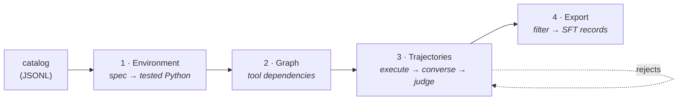

# VULCAN

**Generate multi-turn tool-calling training data from API specifications.**

[](https://openreview.net/forum?id=Ht4HB4pIQq)
[](https://data-fm-iclr2026.github.io/)
[](LICENSE)
[](pyproject.toml)
[](tests/)

Large Language Model agents perform well in narrow tool-use settings but struggle to generalize across diverse environments, because high-quality training data is scarce; existing collection methods rely on manual environment setup and access to live systems, making them labor-intensive and hard to scale. VULCAN is a three-phase framework that automatically constructs executable and deterministic tool-use environments directly from tool schemas, generates diverse task variants over them, and collects high-fidelity agent trajectories by running LLM agents inside those simulated environments. Using VULCAN we simulate 14 environments and generate 78K high-quality training examples from only 232 tools, with experiments across 4 benchmarks and 5 models spanning 2 model families.

**Amir Saeidi · Chitta Baral · Ahmed Awadallah · Harkirat Behl**

*Work done during an internship at Microsoft Research.*

Official implementation of [*VULCAN: Where Agents Learn by Living in Simulated Tool Environments*](https://openreview.net/forum?id=Ht4HB4pIQq), DATA-FM workshop at ICLR 2026.

> [!WARNING]
> VULCAN executes model-generated Python in the host process, with no sandbox. That is how the simulation works. Run it in a container, a VM, or a disposable CI worker.

## Contents

1. [Quickstart](#quickstart)
2. [Workflow](#workflow)
3. [Input](#input)
4. [Output](#output)
5. [Configuration](#configuration)
6. [Run with Claude Code](#run-with-claude-code)
7. [Documentation](#documentation)
8. [Development](#development)
9. [Citation](#citation)

<hr>

## Quickstart

```bash
git clone https://github.com/microsoft/vulcan.git && cd vulcan
python -m venv .venv && source .venv/bin/activate
pip install -e ".[openai]"          # or [anthropic], [gemini], [all]
export OPENAI_API_KEY=sk-...
vulcan --env quickstart --pipeline
```

Runs all 15 steps on a bundled 8-tool catalog and writes records to `outputs/quickstart/training_dataset/`. Costs a few hundred model calls.

```bash
vulcan --list-steps                                    # what runs, in order
vulcan --env quickstart --stage build_graph            # one step
vulcan --env quickstart --pipeline --start generate_trajectories --end judge_trajectories
```

| Flag | Meaning |
|-|-|
| `--env` | config name → `configs/<name>.yaml`, or a path to one |
| `--stage` | run one step |
| `--pipeline` / `--start` / `--end` | all steps, or an inclusive range |
| `--categories` | limit the run to some of the catalog's categories |
| `--iter` | iteration number; rejects from run *k* feed run *k+1* |
| `--output-label` | names the trajectory output folder (default `native`) |
| `--workers` | parallel workers |
| `--list-steps` | print the steps and exit |

## Workflow

```
tool schemas → catalog → environment → graph → sequences → trajectories → dataset
```



**1 · Environment.** A model writes a Python class per tool. They are merged into one stateful environment, then tests are generated, run, and repaired until it behaves.

**2 · Graph.** Every ordered pair of tools is checked for an `explicit` edge (one tool's output feeds another's input) or `implicit` (ordering only). Subgraphs become multi-turn sequences.

**3 · Trajectories.** Each sequence is executed against the live environment first, so broken chains are dropped before any text is generated. Surviving chains become user queries; an agent works them turn by turn; a model judge scores the transcript.

**4 · Export.** Transcripts above `min_score` become training records. Rejects are written back as input for the next iteration.

Each step reads a JSONL, writes `success.jsonl` and `failed.jsonl`, and is resumable on the item's input hash.

| # | Step | Phase |
|-:|-|:-:|
| 1 | `normalize_specs` | 1 |
| 2 | `generate_tools` | 1 |
| 3 | `verify_tools` | 1 |
| 4 | `assemble_environment` | 1 |
| 5 | `debug_environment` | 1 |
| 6 | `generate_states` | 1 |
| 7 | `sample_arguments` | 1 |
| 8 | `build_graph` | 2 |
| 9 | `plan_sequences` | 2 |
| 10 | `score_sequences` | 2 |
| 11 | `execute_sequences` | 3 |
| 12 | `generate_queries` | 3 |
| 13 | `generate_trajectories` | 3 |
| 14 | `judge_trajectories` | 3 |
| 15 | `export_dataset` | 4 |

Full reference: [`docs/pipeline_stages.md`](docs/pipeline_stages.md).

## Input

One JSONL file. **One line per category, every tool inside `api_list`.**

```json
{
  "category_name": "ticket_api",
  "environment_type": "tools_only",
  "api_list": [
    {
      "function": {
        "name": "search_users",
        "description": "Search the user directory by name or email fragment.",
        "parameters": {
          "type": "object",
          "properties": {
            "query": {"type": "string", "description": "Name or email fragment to match."}
          },
          "required": ["query"]
        },
        "response": {
          "type": "object",
          "properties": {
            "count": {"type": "integer", "description": "Number of users returned."}
          }
        }
      }
    }
  ]
}
```

| Field | Required | Meaning |
|-|-|-|
| `category_name` | yes | one environment per category; also a directory name |
| `api_list` | yes | the tools, each as `{"function": {…}}` |
| `environment_type` | no | `tools_only` · `with_user_and_policy` · `with_user` |
| `policy_rules` | no | policy text, inline on this record |
| `api_list[].constraints` | no | free text about one tool |

Write `response` where you can: it is what `build_graph` reads to detect an explicit edge. Without it, `normalize_specs` generates one at a model call per tool.

Convert an existing tool dump, and verify it loads:

```bash
python .claude/skills/simulate-environment/scripts/build_catalog.py \
    --tools your_tools.json --category billing --out examples/billing.jsonl
```

Working examples in [`examples/`](examples/). Field reference and the two shapes that fail silently: [`docs/input_format.md`](docs/input_format.md).

## Output

```
outputs/<name>/
├── training_dataset/{json,xml}/<category>_iter_<k>.jsonl   ← the dataset
├── <category>/iter_<k>/trajectories/<label>/success.jsonl  ← raw conversations
├── <category>/iter_<k>/judged/<label>/success.jsonl        ← with judge scores
└── logs/<category>/<step>.log
```

Records are `{id, category_name, messages}` in both `json` and `xml` tool-call encodings.

> A step can report success while every model call failed, because steps catch per-item errors and emit the row anyway. Check `llm_calls=` in the stage log.

## Configuration

A config is one YAML file in `configs/`, deep-merged over the packaged defaults.

```yaml
environment: hotel
input: {catalog: examples/hotel_booking.jsonl}
output_base: ./outputs/hotel
environment_type: with_user_and_policy   # or tools_only, with_user

llm:
  provider: openai
  model: gpt-4o
```

Run it with `vulcan --env hotel --pipeline`.

### Providers

| `provider` | Serves | Extra | Key |
|-|-|-|-|
| `openai` | GPT | `".[openai]"` | `OPENAI_API_KEY` |
| `anthropic` | Claude | `".[anthropic]"` | `ANTHROPIC_API_KEY` |
| `gemini` | Gemini | `".[gemini]"` | `GEMINI_API_KEY` |
| `openai_compatible` | vLLM, SGLang, Ollama, llama.cpp, TGI | none | usually none |

Any step can override `provider`, `model` or `base_url`, so one run can generate locally and judge on a hosted model:

```yaml
llm:
  provider: openai_compatible
  base_url: http://localhost:8000/v1
  model: Qwen/Qwen3-32B

steps:
  judge_trajectories:
    provider: anthropic
    model: claude-sonnet-5
```

Never set `defaults.model`: it overrides `llm.model` for every stage, which sends one vendor's model name to another.

### Keys that change the output

| Key | Effect |
|-|-|
| `plan_sequences.turns_per_sequence` | turns per conversation (default `"2,3,4"`) |
| `plan_sequences.sequences_per_category` | sequence budget per category |
| `generate_states.num_states` | initial states; the only source of data diversity |
| `generate_trajectories.tool_call_format` | `native` · `reasoning` · `tagged` |
| `export_dataset.min_score` | judge threshold for inclusion (default `8`) |

**Cost.** `build_graph` is *n·(n−1)* model calls for *n* tools: 56 at 8 tools, 462 at 22. It is usually the largest line item in a run.

Every key: [`docs/configuration.md`](docs/configuration.md). Provider differences: [`docs/providers.md`](docs/providers.md).

## Run with Claude Code

Four skills ship in [`.claude/skills/`](.claude/skills/). Cloning the repo is the install.

```bash
cd vulcan && claude
```

Type `/` to confirm `run-vulcan`, `simulate-environment`, `build-tool-graph` and `generate-training-data` are listed, then describe what you want:

```
I have tool schemas in ~/my_api_tools.json. Run VULCAN on them and build me a training set.
```

| Skill | Does |
|-|-|
| `run-vulcan` | the whole pipeline; calls the others in order, confirms before spending |
| `simulate-environment` | schemas → catalog → environment, then reviews it for state and behaviour mismatches, dead arguments, non-determinism and missing tools |
| `build-tool-graph` | estimates cost, builds the graph, checks it is usable |
| `generate-training-data` | trajectories through export, verifying each stage's output |

For every project rather than this one: `cp -r .claude/skills/* ~/.claude/skills/`.

GitHub Copilot reads the same procedures via [`.github/prompts/`](.github/prompts/).

## Documentation

| Page | Covers |
|-|-|
| [`docs/input_format.md`](docs/input_format.md) | the catalog schema, field by field |
| [`docs/pipeline_stages.md`](docs/pipeline_stages.md) | every step: inputs, outputs, config, sharp edges |
| [`docs/configuration.md`](docs/configuration.md) | every config key, and how the layers merge |
| [`docs/providers.md`](docs/providers.md) | provider setup and capability differences |
| [`docs/environment_types.md`](docs/environment_types.md) | how `environment_type` changes each step |
| [`docs/core_components.md`](docs/core_components.md) | runner, stage runner, LLM client, agent |
| [`docs/adding_new_steps.md`](docs/adding_new_steps.md) | writing and registering a step |

## Development

```bash
pip install -e ".[dev]"
pytest                    # 596 tests, about a second, no network
```

A step subclasses `BaseStep`, is registered with `@register_step`, and implements `async run(item, progress)`. Ordering and input resolution live in `vulcan/core/stage_runner.py`, which is authoritative.

This is a research code release, not a supported Microsoft product. Its output is synthetic: the simulated environment approximates the real API, and judge scores are biased toward the judge model. Validate before training on it.

## Citation

```bibtex
@inproceedings{vulcan2026,
  title     = {{VULCAN}: Where Agents Learn by Living in Simulated Tool Environments},
  author    = {Saeidi, Amir and Baral, Chitta and Awadallah, Ahmed and Behl, Harkirat},
  booktitle = {ICLR 2026 Workshop on Navigating and Addressing Data Problems
               for Foundation Models (DATA-FM)},
  year      = {2026},
  url       = {https://openreview.net/forum?id=Ht4HB4pIQq}
}
```
